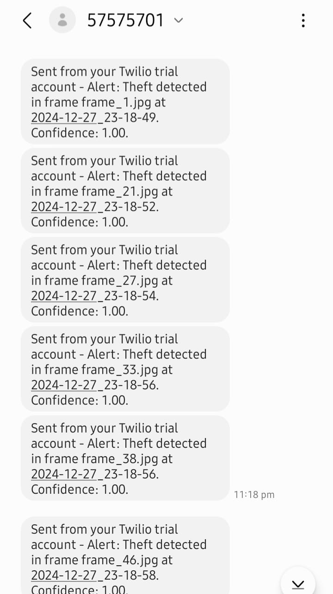

# Theft Detection Using CNN

# Overview
Theft detection is a challenging task, especially when analyzing large volumes of video footage. This project tackles the problem by using Convolutional Neural Networks (CNNs) to identify theft scenes. Instead of working with entire videos, the approach simplifies the process by breaking videos into individual frames. These frames are then analyzed to determine whether they depict theft or not. Using the UCF Crime Dataset, this project aims to create an efficient and accurate tool to assist in detecting suspicious activities in video footage.

# Features

- **Frame-Based Analysis**: Processes individual frames extracted from videos for efficient computation and focused detection.
- **Binary Classification**: Accurately identifies frames as either Theft or No Theft.
- **Optimized CNN Architecture**: Utilizes convolutional layers to extract visual features and classify frames effectively.
- **Preprocessing Workflow**: Includes frame extraction, resizing, normalization, and labeling to prepare data for training.
- **Performance Evaluation**: Assesses accuracy, precision, recall, and F1-score to ensure reliable detection.
- **Alert System**: Implements real-time email and SMS alerts to notify relevant stakeholders in case of theft detection, ensuring immediate response and action.

# Dataset

The project uses the UCF Crime Dataset, which contains a diverse set of videos categorized by different types of crimes. For this project, only videos related to Theft and non-theft activities were used. The dataset was preprocessed to extract frames and create labeled inputs for the CNN.

# Preprocessing

- **Frame Extraction**: Videos were split into frames at regular intervals.
- **Resizing**: Frames were resized to match the input size required by the CNN.
- **Labeling**: Frames were labeled as Theft or No Theft based on their source video.
- **Normalization**: Pixel values were normalized to a [0, 1] range.

# Model Architecture

- **Convolutional Layers**: Three convolutional layers (8, 16, 32 filters) with ReLU activation, batch normalization, and max-pooling for feature extraction.
- **Pooling Layers**: Max-pooling layers after each convolutional layer to reduce spatial dimensions.
- **Dropout**: A dropout layer with 60% rate to prevent overfitting during training.
- **Fully Connected Layer**: A fully connected layer for final binary classification output (Theft or No Theft).

# Training

- **Loss Function**: Cross-Entropy Loss with class weights to address class imbalance.
- **Optimizer**: Adam optimizer with weight decay (`lr=0.001`, `weight_decay=0.0001`).
- **Learning Rate Scheduler**: StepLR to reduce learning rate by a factor of 0.1 every 10 epochs.
- **Epochs**: 30 (adjustable based on requirements).
- **Batch Size**: 32 (assumed from `train_loader` and `test_loader` setup).

# Evaluation Metrics

- **Accuracy**: Training and testing accuracies tracked and plotted for all epochs.
- **F1 Score**: Weighted F1 score to account for class imbalance.
- **Confusion Matrix**: Normalized confusion matrix for detailed performance visualization.
- **ROC-AUC Score**: Evaluates the model's ability to differentiate between classes.
- **Precision-Recall Curve**: Tracks precision and recall trade-offs with an average precision score.

# Outputs and Checkpoints

- **Best Checkpoint**: Saves the best-performing model (`best_checkpoint.model`) based on test accuracy.
- **Final Model**: Saves the final trained model (`final_model.pth`).
- **Plots**:
  - Training vs. Testing Accuracy.
  - Normalized Confusion Matrix.
  - ROC Curve.
  - Precision-Recall Curve.

# Results

The CNN achieved the following results on the test set:
- **Accuracy**: 75%
- **Precision**: 70%
- **Recall**: 69%
- **F1-Score**: 68%

# Alerts

### SMS Alert

### Email Alert

